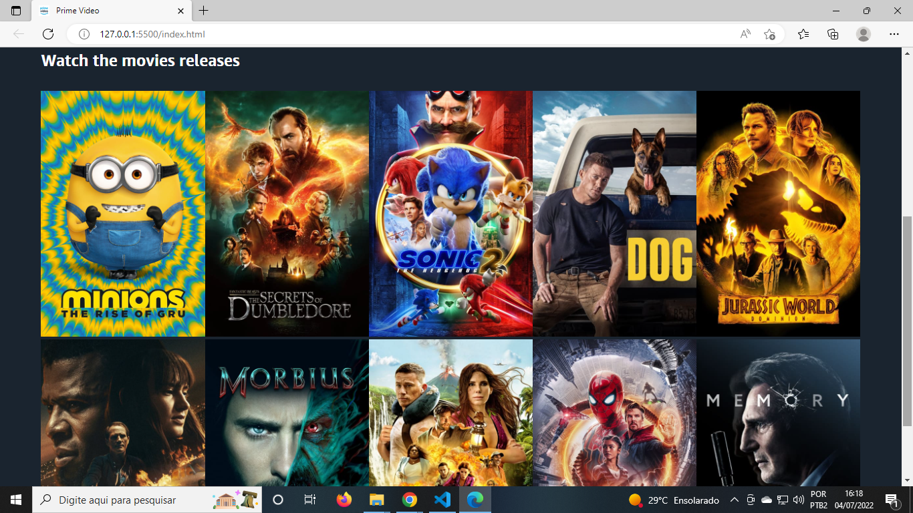

<h1>Amazon Prime Video (Clone with API TheMovieDB)</h1>

Application created to gain experience in API integration.
The page was created with JavaScript, HTML and CSS using Flexbox properties. I didn't use any libraries or frameworks.
Application created with strictly educational use, without any commercial intention!

